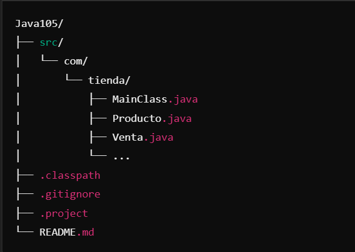

# 🛒 Sistema de Gestión de Ventas

**Proyecto desarrollado en Java utilizando el IDE Eclipse**. Este sistema permite gestionar las ventas de una tienda de manera eficiente, facilitando el registro y seguimiento de productos y transacciones.

## 📄 Descripción

El **Sistema de Gestión de Ventas** es una aplicación diseñada para automatizar y optimizar el proceso de ventas en una tienda. Proporciona funcionalidades para:

- **Gestión de Productos:** Añadir, modificar y eliminar productos del inventario.
- **Registro de Ventas:** Procesar transacciones de ventas y mantener un historial detallado.
- **Consultas y Reportes:** Generar informes sobre ventas realizadas y estado del inventario.

## 🛠️ Tecnologías Utilizadas

- **Lenguaje de Programación:** Java
- **Entorno de Desarrollo:** Eclipse IDE
- **Control de Versiones:** Git

## 🚀 Características

- **Interfaz de Usuario Intuitiva:** Diseño sencillo que facilita la navegación y uso del sistema.
- **Gestión de Inventario:** Control preciso sobre los productos disponibles y sus cantidades.
- **Historial de Ventas:** Registro detallado de todas las transacciones realizadas.
- **Reportes Personalizados:** Generación de informes basados en diferentes criterios para análisis de ventas.

## ⚙️ Instalación y Ejecución

Sigue estos pasos para configurar y ejecutar el proyecto en tu entorno local:

1. **Clonar el repositorio:**
   ```bash
   git clone https://github.com/AldousTheWise/Java105.git

2. **Importar el proyecto en Eclipse:**
- Abre Eclipse y selecciona File > Import.
- Elige Existing Projects into Workspace y haz clic en Next.
- Navega hasta la ubicación donde clonaste el repositorio y selecciona la carpeta del proyecto.
- Haz clic en Finish para completar la importación.

3. **Ejecutar la aplicación:**
- En el Explorador de Proyectos de Eclipse, expande la carpeta src y localiza la clase principal (por ejemplo, MainClass.java).
- Haz clic derecho sobre la clase principal y selecciona Run As > Java Application.

## 🗂️ Estructura del Proyecto
El proyecto está estructurado de forma organizada facilitando su mantenimiento y escalabilidad.



- src/com/tienda/: Contiene los paquetes y clases principales del proyecto.
- .classpath, .project: Archivos de configuración de Eclipse.
- README.md: Archivo con información y documentación del proyecto.

## 🤝 Contribuciones
¡Las contribuciones son bienvenidas! Si deseas colaborar en este proyecto, sigue estos pasos:

1. Haz un fork del repositorio.
2. Crea una nueva rama (git checkout -b feature/nueva-funcionalidad).
3. Realiza los cambios y haz commit (git commit -m 'Añadir nueva funcionalidad').
4. Sube tus cambios (git push origin feature/nueva-funcionalidad).
5. Abre un Pull Request.

**📄 Licencia**
Este proyecto está bajo la Licencia MIT. Consulta el archivo LICENSE para más detalles.

Desarrollado por Aldo Yáñez AKA elSantisimoWD.

